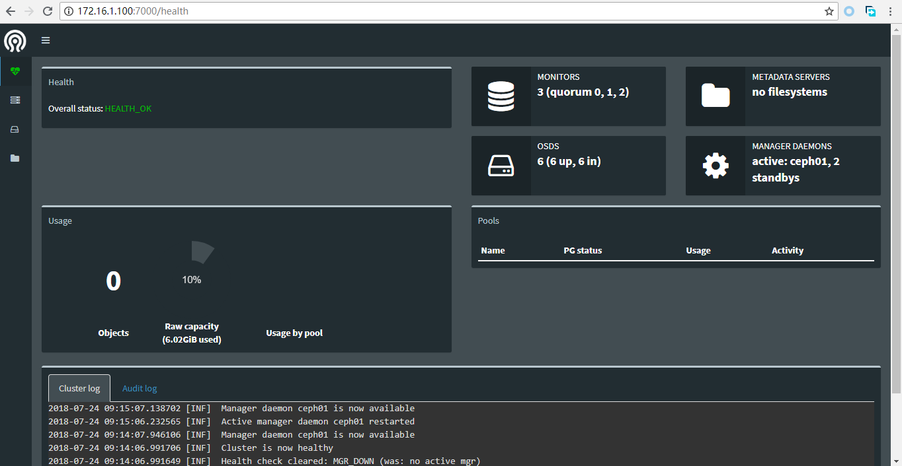

# 部署MGR服务

## Ceph01节点配置MGR

```bash
[root@ceph01 ~]# ceph auth get-or-create mgr.ceph01 mon 'allow profile mgr' osd 'allow *' mds 'allow *' > keyring
[root@ceph01 ~]# mkdir -p /var/lib/ceph/mgr/ceph-ceph01
[root@ceph01 ~]# mv keyring /var/lib/ceph/mgr/ceph-ceph01/
[root@ceph01 ~]# chown -R ceph:ceph /var/lib/ceph/
```

* 创建mgr的keyring，放置到`/var/lib/ceph/mgr/ceph-ceph01`下；
* `ceph-ceph01`的`ceph`为cluster名，`ceph01`为id，可传递给systemd启动服务；

```bash
Created symlink from /etc/systemd/system/ceph-mgr.target.wants/ceph-mgr@ceph01.service to /usr/lib/systemd/system/ceph-mgr@.service.
[root@ceph01 ~]# systemctl start ceph-mgr@ceph01
[root@ceph01 ~]# systemctl status ceph-mgr@ceph01
● ceph-mgr@ceph01.service - Ceph cluster manager daemon
   Loaded: loaded (/usr/lib/systemd/system/ceph-mgr@.service; enabled; vendor preset: disabled)
   Active: active (running) since Tue 2018-07-24 09:14:06 CST; 7s ago
 Main PID: 1885 (ceph-mgr)
   CGroup: /system.slice/system-ceph\x2dmgr.slice/ceph-mgr@ceph01.service
           └─1885 /usr/bin/ceph-mgr -f --cluster ceph --id ceph01 --setuser ceph --setgroup ceph

Jul 24 09:14:06 ceph01 systemd[1]: Started Ceph cluster manager daemon.
Jul 24 09:14:06 ceph01 systemd[1]: Starting Ceph cluster manager daemon...
```

* 通过systemd启动ceph-mgr@ceph-ceph01实例；
* 也可以通过`ceph-mgr -i ceph01`命令启动mgr，但建议用systemd服务来启动；

```bash
[root@ceph01 ~]# ceph -s
  cluster:
    id:     5882486a-47fc-4178-8e41-8e8d88bf2b9d
    health: HEALTH_OK

  services:
    mon: 3 daemons, quorum ceph01,ceph02,ceph03
    mgr: ceph01(active)
    osd: 6 osds: 6 up, 6 in

  data:
    pools:   0 pools, 0 pgs
    objects: 0 objects, 0 bytes
    usage:   6170 MB used, 55245 MB / 61416 MB avail
    pgs:
```

* 检查mgr状态。

## Ceph02节点配置MGR

```bash
[root@ceph02 ~]# ceph auth get-or-create mgr.ceph02 mon 'allow profile mgr' osd 'allow *' mds 'allow *' > keyring
[root@ceph02 ~]# mkdir -p /var/lib/ceph/mgr/ceph-ceph02
[root@ceph02 ~]# mv keyring /var/lib/ceph/mgr/ceph-ceph02/
[root@ceph02 ~]# chown -R ceph:ceph /var/lib/ceph/
```

* 创建mgr的keyring，放置到`/var/lib/ceph/mgr/ceph-ceph02`下；
* `ceph-ceph02`的`ceph`为cluster名，`ceph02`为id，可传递给systemd启动服务；

```bash
[root@ceph02 ~]# systemctl enable ceph-mgr@ceph02
Created symlink from /etc/systemd/system/ceph-mgr.target.wants/ceph-mgr@ceph02.service to /usr/lib/systemd/system/ceph-mgr@.service.
[root@ceph02 ~]# systemctl start ceph-mgr@ceph02
[root@ceph02 ~]# systemctl status ceph-mgr@ceph02
● ceph-mgr@ceph02.service - Ceph cluster manager daemon
   Loaded: loaded (/usr/lib/systemd/system/ceph-mgr@.service; enabled; vendor preset: disabled)
   Active: active (running) since Tue 2018-07-24 09:23:22 CST; 6s ago
 Main PID: 1799 (ceph-mgr)
   CGroup: /system.slice/system-ceph\x2dmgr.slice/ceph-mgr@ceph02.service
           └─1799 /usr/bin/ceph-mgr -f --cluster ceph --id ceph02 --setuser ceph --setgroup ceph

Jul 24 09:23:22 ceph02 systemd[1]: Started Ceph cluster manager daemon.
Jul 24 09:23:22 ceph02 systemd[1]: Starting Ceph cluster manager daemon...
Jul 24 09:23:24 ceph02 ceph-mgr[1799]: [24/Jul/2018:09:23:24] ENGINE Bus STARTING
Jul 24 09:23:24 ceph02 ceph-mgr[1799]: CherryPy Checker:
Jul 24 09:23:24 ceph02 ceph-mgr[1799]: The Application mounted at '' has an empty config.
Jul 24 09:23:24 ceph02 ceph-mgr[1799]: [24/Jul/2018:09:23:24] ENGINE Started monitor thread '_TimeoutMonitor'.
Jul 24 09:23:24 ceph02 ceph-mgr[1799]: [24/Jul/2018:09:23:24] ENGINE Serving on :::7000
Jul 24 09:23:24 ceph02 ceph-mgr[1799]: [24/Jul/2018:09:23:24] ENGINE Bus STARTED
```

* 通过systemd启动mgr服务；

```bash
[root@ceph02 ~]# ceph -s
  cluster:
    id:     5882486a-47fc-4178-8e41-8e8d88bf2b9d
    health: HEALTH_OK

  services:
    mon: 3 daemons, quorum ceph01,ceph02,ceph03
    mgr: ceph01(active), standbys: ceph02
    osd: 6 osds: 6 up, 6 in

  data:
    pools:   0 pools, 0 pgs
    objects: 0 objects, 0 bytes
    usage:   6170 MB used, 55245 MB / 61416 MB avail
    pgs:
```

* 检查mgr状态；

## Ceph03节点配置MGR

```bash
[root@ceph03 ~]# ceph auth get-or-create mgr.ceph03 mon 'allow profile mgr' osd 'allow *' mds 'allow *' > keyring
[root@ceph03 ~]# mkdir -p /var/lib/ceph/mgr/ceph-ceph03
[root@ceph03 ~]# mv keyring /var/lib/ceph/mgr/ceph-ceph03/
[root@ceph03 ~]# chown -R ceph:ceph /var/lib/ceph/
```

* 创建mgr的keyring，放置到`/var/lib/ceph/mgr/ceph-ceph03`下；
* `ceph-ceph03`的`ceph`为cluster名，`ceph03`为id，可传递给systemd启动服务；

```bash
[root@ceph03 ~]# systemctl enable ceph-mgr@ceph03
Created symlink from /etc/systemd/system/ceph-mgr.target.wants/ceph-mgr@ceph03.service to /usr/lib/systemd/system/ceph-mgr@.service.
[root@ceph03 ~]# systemctl start ceph-mgr@ceph03
[root@ceph03 ~]# systemctl status ceph-mgr@ceph03
● ceph-mgr@ceph03.service - Ceph cluster manager daemon
   Loaded: loaded (/usr/lib/systemd/system/ceph-mgr@.service; enabled; vendor preset: disabled)
   Active: active (running) since Tue 2018-07-24 09:27:10 CST; 5s ago
 Main PID: 1925 (ceph-mgr)
   CGroup: /system.slice/system-ceph\x2dmgr.slice/ceph-mgr@ceph03.service
           └─1925 /usr/bin/ceph-mgr -f --cluster ceph --id ceph03 --setuser ceph --setgroup ceph

Jul 24 09:27:10 ceph03 systemd[1]: Started Ceph cluster manager daemon.
Jul 24 09:27:10 ceph03 systemd[1]: Starting Ceph cluster manager daemon...
Jul 24 09:27:11 ceph03 ceph-mgr[1925]: [24/Jul/2018:09:27:11] ENGINE Bus STARTING
Jul 24 09:27:11 ceph03 ceph-mgr[1925]: CherryPy Checker:
Jul 24 09:27:11 ceph03 ceph-mgr[1925]: The Application mounted at '' has an empty config.
Jul 24 09:27:11 ceph03 ceph-mgr[1925]: [24/Jul/2018:09:27:11] ENGINE Started monitor thread '_TimeoutMonitor'.
Jul 24 09:27:11 ceph03 ceph-mgr[1925]: [24/Jul/2018:09:27:11] ENGINE Serving on :::7000
Jul 24 09:27:11 ceph03 ceph-mgr[1925]: [24/Jul/2018:09:27:11] ENGINE Bus STARTED
```

* 通过systemd启动mgr服务；

```bash
[root@ceph03 ~]# ceph -s
  cluster:
    id:     5882486a-47fc-4178-8e41-8e8d88bf2b9d
    health: HEALTH_OK

  services:
    mon: 3 daemons, quorum ceph01,ceph02,ceph03
    mgr: ceph01(active), standbys: ceph02, ceph03
    osd: 6 osds: 6 up, 6 in

  data:
    pools:   0 pools, 0 pgs
    objects: 0 objects, 0 bytes
    usage:   6170 MB used, 55245 MB / 61416 MB avail
    pgs:
```

* 检查mgr状态；

## 启用Dashboard

```bash
[root@ceph01 ~]# ceph mgr module enable dashboard
[root@ceph01 ~]# netstat -ntlp |grep mgr
tcp        0      0 172.16.1.100:6804       0.0.0.0:*               LISTEN      1885/ceph-mgr
tcp6       0      0 :::7000                 :::*                    LISTEN      1885/ceph-mgr
```

* ceph-mgr会在所有mgr节点启动一个新进程，监听在7000端口，提供Dashboard服务；

## 访问Dashboard

```bash
172.16.1.100    ceph01
172.16.1.101    ceph02
172.16.1.102    ceph03
```

* 在客户端增加hosts配置项，方便访问mgr standby节点的dashboard时能跳转到active节点；
* 访问[http://172.16.1.100:7000](http://172.16.1.100:7000)访问Dashboard；
* 界面如下：

