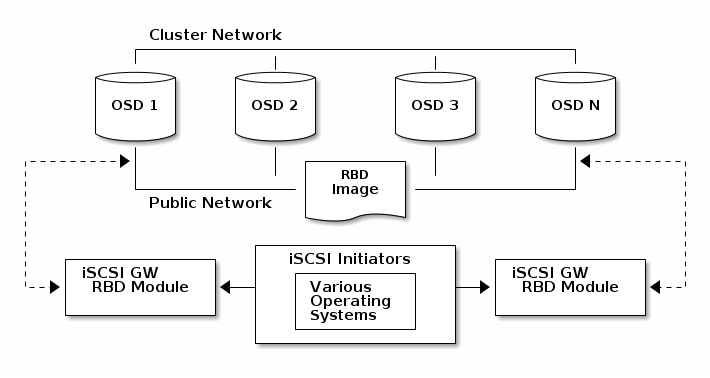

# Ceph RBD使用

## RBD命令

### 创建用户

```bash
[root@ceph01 ~]# ceph auth get-or-create client.rbd mon 'profile rbd' osd 'profile rbd pool=rbd'
[root@ceph01 ~]# ceph auth get client.rbd
exported keyring for client.rbd
[client.rbd]
    key = AQDG5pBbjsv5BRAAj3HIN3wsSymrBEPH49EBhQ==
    caps mon = "profile rbd"
    caps osd = "profile rbd pool=rbd"
```

### 创建镜像

```bash
[root@ceph01 ~]# rbd create --size 256 rbd/test001
```

### 列出镜像

```bash
[root@ceph01 ~]# rbd ls
test001
[root@ceph01 ~]# rbd ls rbd
test001
```

### 查看镜像信息

```bash
[root@ceph01 ~]# rbd info rbd/test001
rbd image 'test001':
    size 256 MB in 64 objects
    order 22 (4096 kB objects)
    block_name_prefix: rbd_data.380d643c9869
    format: 2
    features: layering, exclusive-lock, object-map, fast-diff, deep-flatten
    flags:
    create_timestamp: Thu Sep  6 16:15:28 2018
```

### 调整镜像大小

```bash
[root@ceph01 ~]# rbd resize --size 512 test001
Resizing image: 100% complete...done.
[root@ceph01 ~]# rbd info rbd/test001
rbd image 'test001':
    size 512 MB in 128 objects
    order 22 (4096 kB objects)
    block_name_prefix: rbd_data.380d643c9869
    format: 2
    features: layering, exclusive-lock, object-map, fast-diff, deep-flatten
    flags:
    create_timestamp: Thu Sep  6 16:15:28 2018
```

### 删除镜像设备

```bash
[root@ceph01 ~]# rbd rm rbd/test001
Removing image: 100% complete...done.
```

* 直接删除镜像；

```bash
[root@ceph01 ~]# rbd create --size 100 test002
[root@ceph01 ~]# rbd ls
test002
[root@ceph01 ~]# rbd trash mv test002
```

* 移动镜像到回收站；

```bash
[root@ceph01 ~]# rbd trash ls
383774b0dc51 test002
[root@ceph01 ~]# rbd trash restore 383774b0dc51
[root@ceph01 ~]# rbd ls
test002
```

* 从回收站恢复镜像；

```bash
[root@ceph01 ~]# rbd trash mv test002
[root@ceph01 ~]# rbd trash ls
383774b0dc51 test002
[root@ceph01 ~]# rbd trash rm 383774b0dc51
Removing image: 100% complete...done.
[root@ceph01 ~]# rbd trash ls
```

* 从回收站删除镜像；

## 映射使用镜像

```bash
[root@ceph01 ~]# rbd create --size 100 rbd/test003
[root@ceph01 ~]# ceph auth get-or-create client.rbd -o /etc/ceph/ceph.client.rbd.keyring
```

* 创建镜像和client.rbd用户keyring；

```bash
[root@ceph01 ~]# rbd map rbd/test003 --id rbd
rbd: sysfs write failed
RBD image feature set mismatch. You can disable features unsupported by the kernel with "rbd feature disable test003 object-map fast-diff deep-flatten".
In some cases useful info is found in syslog - try "dmesg | tail".
rbd: map failed: (6) No such device or address
[root@ceph01 ~]# dmesg |tail
[1595400.298032] libceph: client14280 fsid 7922fd83-2140-44d6-9729-9fd4a8541469
[1595724.714327] fuse init (API version 7.22)
[1596093.873764] libceph: mon0 172.16.16.240:6789 session established
[1596093.874325] libceph: client14289 fsid 7922fd83-2140-44d6-9729-9fd4a8541469
[1597646.781432] libceph: mon0 172.16.16.240:6789 session established
[1597646.781943] libceph: client14295 fsid 7922fd83-2140-44d6-9729-9fd4a8541469
[2435534.200083] rbd: loaded (major 252)
[2435534.204113] libceph: mon0 172.16.16.240:6789 session established
[2435534.204729] libceph: client14460 fsid 7922fd83-2140-44d6-9729-9fd4a8541469
[2435534.211273] rbd: image test003: image uses unsupported features: 0x38
[root@ceph01 ~]# rbd feature disable test003 exclusive-lock, object-map, fast-diff, deep-flatten
[root@ceph01 ~]# rbd map rbd/test003 --id rbd
/dev/rbd0
```

* 挂载rbd时出现特性不支持，先禁用块设备的特性，再重新映射块设备；

```bash
[root@ceph01 ~]# fdisk -l /dev/rbd0

Disk /dev/rbd0: 104 MB, 104857600 bytes, 204800 sectors
Units = sectors of 1 * 512 = 512 bytes
Sector size (logical/physical): 512 bytes / 512 bytes
I/O size (minimum/optimal): 4194304 bytes / 4194304 bytes
```

* fdisk检查块设备大小；

```bash
[root@ceph01 ~]# rbd unmap rbd/test003
[root@ceph01 ~]# fdisk -l /dev/rbd0
fdisk: cannot open /dev/rbd0: No such file or directory
```

* 取消块设备的映射；

## 快照和克隆

### 镜像快照

```bash
[root@ceph01 ~]# rbd snap create rbd/test003@`date +%G%m%d%H%M%S`
[root@ceph01 ~]# rbd snap ls rbd/test003
SNAPID NAME                SIZE TIMESTAMP
     4 20180906170606 102400 kB Thu Sep  6 17:06:07 2018
```

```bash
[root@ceph01 ~]# rbd snap rollback rbd/test003@20180906170606
Rolling back to snapshot: 100% complete...done.
```

* 回滚到快照时的状态；

```bash
[root@ceph01 ~]# rbd snap rm rbd/test003@20180906170606
Removing snap: 100% complete...done.
```

* 删除快照；

```bash
[root@ceph01 ~]# rbd snap create rbd/test003@`date +%G%m%d%H%M%S`
[root@ceph01 ~]# rbd snap create rbd/test003@`date +%G%m%d%H%M%S`
[root@ceph01 ~]# rbd snap ls rbd/test003
SNAPID NAME                SIZE TIMESTAMP
     6 20180910145805 102400 kB Mon Sep 10 14:58:05 2018
     7 20180910145811 102400 kB Mon Sep 10 14:58:11 2018
[root@ceph01 ~]# rbd snap purge rbd/test003
Removing all snapshots: 100% complete...done.
[root@ceph01 ~]# rbd snap ls rbd/test003
```

* 清除所有快照；

### 镜像克隆

```bash
[root@ceph01 ~]# rbd snap create rbd/test003@forclone
[root@ceph01 ~]# rbd snap protect rbd/test003@forclone
[root@ceph01 ~]# rbd clone rbd/test003@forclone rbd/test004
[root@ceph01 ~]# rbd ls
test003
test004
[root@ceph01 ~]# rbd snap ls rbd/test003
SNAPID NAME          SIZE TIMESTAMP
    10 forclone 102400 kB Mon Sep 10 15:09:33 2018
[root@ceph01 ~]# rbd info test003@forclone
rbd image 'test003':
    size 102400 kB in 25 objects
    order 22 (4096 kB objects)
    block_name_prefix: rbd_data.3879643c9869
    format: 2
    features: layering
    flags:
    create_timestamp: Thu Sep  6 16:48:35 2018
    protected: True
[root@ceph01 ~]# rbd info test004
rbd image 'test004':
    size 102400 kB in 25 objects
    order 22 (4096 kB objects)
    block_name_prefix: rbd_data.38c4238e1f29
    format: 2
    features: layering
    flags:
    create_timestamp: Mon Sep 10 15:10:19 2018
    parent: rbd/test003@forclone
    overlap: 102400 kB
```

* 克隆前需要对镜像做快照，并对快照设置保护（被保护的镜像是无法删除的）；
* 克隆后，原有的镜像快照将成为新镜像的父镜像；

```bash
[root@ceph01 ~]# rbd children test003@forclone
rbd/test004
[root@ceph01 ~]# rbd flatten rbd/test004
Image flatten: 100% complete...done.
[root@ceph01 ~]# rbd info rbd/test004
rbd image 'test004':
    size 102400 kB in 25 objects
    order 22 (4096 kB objects)
    block_name_prefix: rbd_data.38c4238e1f29
    format: 2
    features: layering
    flags:
    create_timestamp: Mon Sep 10 15:10:19 2018

[root@ceph01 ~]# rbd snap unprotect rbd/test003@forclone
[root@ceph01 ~]# rbd info rbd/test003@forclone
rbd image 'test003':
    size 102400 kB in 25 objects
    order 22 (4096 kB objects)
    block_name_prefix: rbd_data.3879643c9869
    format: 2
    features: layering
    flags:
    create_timestamp: Thu Sep  6 16:48:35 2018
    protected: False
[root@ceph01 ~]# rbd snap rm rbd/test003@forclone
Removing snap: 100% complete...done.
```

* 删除快照前，必须先取消保护，并且无法删除被克隆引用的快照，因此需要删除前执行flatten操作，将快照合并到克隆，再取消保护删除;

## ISCSI Gateway

iSCSI Gateway为Ceph提供了原生的RBD转iSCSI的支持，并且提供了target的高可用。iSCSI Gateway通过TCMU与Ceph的librbd库进行交互，并将RBD images映射给iSCSI客户端。

### 架构图



### 调整OSD参数

```bash
[root@ceph01 ~]# for x in {0..5}; do ceph tell osd.$x config set osd_heartbeat_grace 20 && ceph tell osd.$x config set osd_heartbeat_interval 5; done
[root@ceph01 ~]# for x in {0..5};do ceph daemon osd.$x config set osd_heartbeat_grace 20 && ceph daemon osd.$x config set osd_heartbeat_interval 5;done
[root@ceph02 ~]# for x in {0..5};do ceph daemon osd.$x config set osd_heartbeat_grace 20 && ceph daemon osd.$x config set osd_heartbeat_interval 5;done
[root@ceph03 ~]# for x in {0..5};do ceph daemon osd.$x config set osd_heartbeat_grace 20 && ceph daemon osd.$x config set osd_heartbeat_interval 5;done
```

* 配置ISCSI Gateway时没有专门的ceph参数，但推荐修改以上OSD的默认失败超时，减少initial的超时可能性；
* 可用`ceph tell`在线修改mon参数，`ceph daemon`在线修改osd参数；

```bash
[root@ceph01 ~]# vi /etc/ceph/ceph.conf
[osd]
osd heartbeat grace = 20
osd heartbeat interval = 5
```

* 在ceph01、ceph02、ceph03节点都修改`ceph.conf`参数，增加osd的失败超时时间；

### 升级内核版本

```bash
[root@ceph01 ~]# rpm --import https://www.elrepo.org/RPM-GPG-KEY-elrepo.org
[root@ceph01 ~]# rpm -Uvh http://www.elrepo.org/elrepo-release-7.0-3.el7.elrepo.noarch.rpm
[root@ceph01 ~]# yum --enablerepo=elrepo-kernel -y install kernel-ml
[root@ceph01 ~]# grub2-set-default 0
[root@ceph01 ~]# grub2-mkconfig -o /boot/grub2/grub.cfg

[root@ceph02 ~]# rpm --import https://www.elrepo.org/RPM-GPG-KEY-elrepo.org
[root@ceph02 ~]# rpm -Uvh http://www.elrepo.org/elrepo-release-7.0-3.el7.elrepo.noarch.rpm
[root@ceph02 ~]# yum --enablerepo=elrepo-kernel -y install kernel-ml
[root@ceph02 ~]# grub2-set-default 0
[root@ceph02 ~]# grub2-mkconfig -o /boot/grub2/grub.cfg

[root@ceph03 ~]# rpm --import https://www.elrepo.org/RPM-GPG-KEY-elrepo.org
[root@ceph03 ~]# rpm -Uvh http://www.elrepo.org/elrepo-release-7.0-3.el7.elrepo.noarch.rpm
[root@ceph03 ~]# yum --enablerepo=elrepo-kernel -y install kernel-ml
[root@ceph03 ~]# grub2-set-default 0
[root@ceph03 ~]# grub2-mkconfig -o /boot/grub2/grub.cfg
```

* Ceph iSCSI gateway需要RHEL/CentOS 7.5版本或者v4.16版本内核，如果需要升级内核，可以按照以上方法升级到mainline内核；

### 设置防火墙规则

```bash
[root@ceph01 ~]# firewall-cmd --zone=public --add-port=5000/tcp --permanent
[root@ceph01 ~]# firewall-cmd --zone=public --add-port=3260/tcp --permanent
[root@ceph01 ~]# firewall-cmd --zone=public --add-port=9287/tcp --permanent

[root@ceph01 ~]# firewall-cmd --reload
```

* `3260/TCP`端口为iscsi target服务监听端口；
* `5000/TCP`端口为Ceph iSCSI gateway服务监听端口；
* `9287/TCP`端口为RBD target gateway服务监听端口；
* 在ceph01、ceph02、ceph03节点上都增加以上防火墙规则；

### 安装软件包

要使用Ceph iSCSI gateway，还需要安装大于等于以下版本的相关软件包（目前以下软件包都需要通过编译来安装）：

* targetcli-2.1.fb47
* python-rtslib-2.1.fb64
* tcmu-runner-1.3.0
* ceph-iscsi-config-2.4
* ceph-iscsi-cli-2.5

```bash
[root@ceph01 ~]# yum install libnl3 libnl3-devel kmod kmod-devel python-devel librbd1 pyparsing python-kmod python-pyudev python-gobject python-urwid python-rados python-rbd python-netaddr python-netifaces python-crypto python-requests python-flask pyOpenSSL pcp python-pcp
```

* `ceph-iscsi-config`，`ceph-iscsi-cli`，`ceph-iscsi-tools`软件包都需要源代码编译；
* ceph01、ceph02、ceph03节点编译安装还依赖以上的库文件，因为安装了kmod，需要重启系统；

```bash
[root@ceph01 ~]# git clone https://github.com/open-iscsi/tcmu-runner
[root@ceph01 ~]# cd tcmu-runner/
[root@ceph01 tcmu-runner]# ./extra/install_dep.sh
[root@ceph01 tcmu-runner]# cmake -Dwith-glfs=false -Dwith-qcow=false -DSUPPORT_SYSTEMD=ON -DCMAKE_INSTALL_PREFIX=/usr
[root@ceph01 tcmu-runner]# make install
[root@ceph01 tcmu-runner]# systemctl daemon-reload
[root@ceph01 tcmu-runner]# systemctl enable tcmu-runner
[root@ceph01 tcmu-runner]# systemctl start tcmu-runner
```

* ceph01、ceph02、ceph03节点源代码编译tcmu-runner，安装时需要执行`install_dep.sh`来安装依赖包；

```bash
[root@ceph01 ~]# git clone https://github.com/open-iscsi/rtslib-fb.git
[root@ceph01 ~]# cd rtslib-fb/
[root@ceph01 rtslib-fb]# python setup.py install
```

* ceph01、ceph02、ceph03节点源代码编译rtslib-fb包；

```bash
[root@ceph01 ~]# git clone https://github.com/open-iscsi/targetcli-fb.git
[root@ceph01 ~]# cd targetcli-fb/
[root@ceph01 targetcli-fb]# python setup.py install
[root@ceph01 targetcli-fb]# mkdir /etc/target && mkdir /var/target
```

* 源代码编译targetcli-fb包；

```bash
[root@ceph01 ~]# git clone https://github.com/open-iscsi/configshell-fb.git
[root@ceph01 ~]# cd configshell-fb/
[root@ceph01 configshell-fb]# python setup.py install
```

* 源代码编译configshell-fb包（ceph-iscsi-config依赖该软件包）；

```bash
[root@ceph01 ~]# git clone https://github.com/ceph/ceph-iscsi-config.git
[root@ceph01 ~]# cd ceph-iscsi-config
[root@ceph01 ceph-iscsi-config]# python setup.py install --install-scripts=/usr/bin
[root@ceph01 ceph-iscsi-config]# cp usr/lib/systemd/system/rbd-target-gw.service /usr/lib/systemd/system/
[root@ceph01 ceph-iscsi-config]# systemctl enable rbd-target-gw
[root@ceph01 ceph-iscsi-config]# systemctl start rbd-target-gw
[root@ceph01 ceph-iscsi-config]# systemctl status rbd-target-gw
```

* 在ceph01、ceph02、ceph03节点上编译安装`ceph-iscsi-config`；

```bash
[root@ceph01 ~]# git clone https://github.com/ceph/ceph-iscsi-cli.git
[root@ceph01 ~]# cd ceph-iscsi-cli
[root@ceph01 ceph-iscsi-cli]# python setup.py install --install-scripts=/usr/bin
[root@ceph01 ceph-iscsi-cli]# cp usr/lib/systemd/system/rbd-target-api.service /usr/lib/systemd/system/

[root@ceph01 ~]# vi /etc/ceph/iscsi-gateway.cfg
[config]
# Name of the Ceph storage cluster. A suitable Ceph configuration file allowing
# access to the Ceph storage cluster from the gateway node is required, if not
# colocated on an OSD node.
cluster_name = ceph

# Place a copy of the ceph cluster's admin keyring in the gateway's /etc/ceph
# drectory and reference the filename here
gateway_keyring = ceph.client.admin.keyring


# API settings.
# The API supports a number of options that allow you to tailor it to your
# local environment. If you want to run the API under https, you will need to
# create cert/key files that are compatible for each iSCSI gateway node, that is
# not locked to a specific node. SSL cert and key files *must* be called
# 'iscsi-gateway.crt' and 'iscsi-gateway.key' and placed in the '/etc/ceph/' directory
# on *each* gateway node. With the SSL files in place, you can use 'api_secure = true'
# to switch to https mode.

# To support the API, the bear minimum settings are:
api_secure = false

# Additional API configuration options are as follows, defaults shown.
# api_user = admin
# api_password = admin
# api_port = 5001
trusted_ip_list = 172.16.16.240,172.16.16.241,172.16.16.242
[root@ceph01 ceph-iscsi-cli]# systemctl daemon-reload
[root@ceph01 ceph-iscsi-cli]# systemctl enable rbd-target-api
[root@ceph01 ceph-iscsi-cli]# systemctl start rbd-target-api
```

* 在ceph01、ceph02、ceph03节点上编译安装`ceph-iscsi-cli`；
* 启动前需要创建修改/etc/ceph/iscsi-gateway.cfg配置参数；
* trusted_ip_list为gateway服务的ip地址；

### 配置Ceph iSCSI target

```bash
[root@ceph01 ~]# ceph osd lspools
1 rbd,2 .rgw.root,3 default.rgw.control,4 default.rgw.meta,5 default.rgw.log,6 cephfs_data,7 cephfs_metadata,
```

* `gwcli`命令默认需要操作rbd pool，所以先确认rbd pool是否存在；

```bash
[root@ceph01 ~]# gwcli
/> cd /iscsi-target
/iscsi-target> create iqn.2018-09.local.ceph.iscsi-gw:iscsi-igw
ok
/iscsi-target> cd iqn.2018-09.local.ceph.iscsi-gw:iscsi-igw/gateways
/iscsi-target...-igw/gateways> ls
o- gateways .................................................................................................. [Up: 0/0, Portals: 0]
/iscsi-target...-igw/gateways> create ceph01 172.16.16.240 skipchecks=true
OS version/package checks have been bypassed
Adding gateway, sync'ing 0 disk(s) and 0 client(s)
ok
/iscsi-target...-igw/gateways> create ceph02 172.16.16.241 skipchecks=true
OS version/package checks have been bypassed
Adding gateway, sync'ing 0 disk(s) and 0 client(s)
ok
/iscsi-target...-igw/gateways> create ceph03 172.16.16.242 skipchecks=true
OS version/package checks have been bypassed
Adding gateway, sync'ing 0 disk(s) and 0 client(s)
ok
```

* 添加`skipchecks=true`跳过软件包版本检查，否则会提示"Failed : ceph01 failed package validation checks - python-rtslib rpm must be installed at >= 2.1.fb64-0.1,tcmu-runner rpm must be installed at >= 1.3.0-0.2.3"错误；

```bash
/iscsi-target...-igw/gateways> cd /disks/
/disks> create pool=rbd image=iscsi001 size=1G
ok
/disks> cd /iscsi-target/iqn.2018-09.local.ceph.iscsi-gw:iscsi-igw/hosts
/iscsi-target...csi-igw/hosts> create iqn.2018-09.local.ceph:initial-01
ok
/iscsi-target...ph:initial-01> auth chap=iscsiuser/iscsipassword
ok
/iscsi-target...ph:initial-01> disk add rbd.iscsi001
ok
```

* 创建磁盘，并设置CHAP认证，将磁盘绑定到initial；

```bash
/iscsi-target...ph:initial-01> ls /
o- / .................................................................. [...]
  o- clusters ................................................. [Clusters: 1]
  | o- ceph ..................................................... [HEALTH_OK]
  |   o- pools ................................................... [Pools: 7]
  |   | o- .rgw.root .................. [(x3), Commit: 0b/36G (0%), Used: 1K]
  |   | o- cephfs_data ............... [(x3), Commit: 0b/36G (0%), Used: 27K]
  |   | o- cephfs_metadata ........... [(x3), Commit: 0b/36G (0%), Used: 20K]
  |   | o- default.rgw.control ........ [(x3), Commit: 0b/36G (0%), Used: 0b]
  |   | o- default.rgw.log ............ [(x3), Commit: 0b/36G (0%), Used: 0b]
  |   | o- default.rgw.meta ........... [(x3), Commit: 0b/36G (0%), Used: 0b]
  |   | o- rbd ........................ [(x3), Commit: 1G/36G (2%), Used: 2K]
  |   o- topology ......................................... [OSDs: 6,MONs: 3]
  o- disks ................................................... [1G, Disks: 1]
  | o- rbd.iscsi001 ....................................... [iscsi001 (1G)]
  o- iscsi-target .............................................. [Targets: 1]
    o- iqn.2018-09.local.ceph.iscsi-gw:iscsi-igw .............. [Gateways: 3]
      o- gateways ..................................... [Up: 3/3, Portals: 3]
      | o- ceph01 ...................................... [172.16.16.240 (UP)]
      | o- ceph02 ...................................... [172.16.16.241 (UP)]
      | o- ceph03 ...................................... [172.16.16.242 (UP)]
      o- host-groups ........................................... [Groups : 0]
      o- hosts ................................................... [Hosts: 1]
        o- iqn.2018-09.local.ceph:initial-01 ..... [Auth: CHAP, Disks: 1(1G)]
          o- lun 0 ....................... [rbd.iscsi001(1G), Owner: ceph02]
```

### 配置客户端

```bash
[root@ceph01 ~]# yum install iscsi-initiator-utils device-mapper-multipath
[root@ceph01 ~]# mpathconf --enable --with_multipathd y
[root@ceph01 ~]# vi /etc/multipath.conf
devices {
        device {
                vendor                 "LIO-ORG"
                hardware_handler       "1 alua"
                path_grouping_policy   "failover"
                path_selector          "queue-length 0"
                failback               60
                path_checker           tur
                prio                   alua
                prio_args              exclusive_pref_bit
                fast_io_fail_tmo       25
                no_path_retry          queue
        }
}
[root@ceph01 ~]# systemctl reload multipathd
```

* 配置系统多路径软件；

```bash
[root@ceph01 ~]# vi /etc/iscsi/iscsid.conf
node.session.auth.authmethod = CHAP
node.session.auth.username = iscsiuser
node.session.auth.password = iscsipassword

[root@ceph01 ~]# vi /etc/iscsi/initiatorname.iscsi
InitiatorName=iqn.2018-09.local.ceph:initial-01
```

* 设置iscsi initial的CHAP认证和initial名，用于发起iscsi链接；

```bash
[root@ceph01 ~]# iscsiadm -m discovery -t st -p 172.16.16.240
172.16.16.240:3260,1 iqn.2018-09.local.ceph.iscsi-gw:iscsi-igw
172.16.16.241:3260,2 iqn.2018-09.local.ceph.iscsi-gw:iscsi-igw
172.16.16.242:3260,3 iqn.2018-09.local.ceph.iscsi-gw:iscsi-igw

[root@ceph01 ~]# iscsiadm -m node -T iqn.2018-09.local.ceph.iscsi-gw:iscsi-igw -l
Logging in to [iface: default, target: iqn.2018-09.local.ceph.iscsi-gw:iscsi-igw, portal: 172.16.16.240,3260] (multiple)
Logging in to [iface: default, target: iqn.2018-09.local.ceph.iscsi-gw:iscsi-igw, portal: 172.16.16.241,3260] (multiple)
Logging in to [iface: default, target: iqn.2018-09.local.ceph.iscsi-gw:iscsi-igw, portal: 172.16.16.242,3260] (multiple)
Login to [iface: default, target: iqn.2018-09.local.ceph.iscsi-gw:iscsi-igw, portal: 172.16.16.240,3260] successful.
Login to [iface: default, target: iqn.2018-09.local.ceph.iscsi-gw:iscsi-igw, portal: 172.16.16.241,3260] successful.
Login to [iface: default, target: iqn.2018-09.local.ceph.iscsi-gw:iscsi-igw, portal: 172.16.16.242,3260] successful.

[root@ceph01 ~]# multipath -ll
3600140573fd4eb46b644bea87d0b6a57 dm-2 LIO-ORG ,TCMU device
size=1.0G features='1 queue_if_no_path' hwhandler='1 alua' wp=rw
|-+- policy='queue-length 0' prio=50 status=active
| `- 5:0:0:0 sde 8:64 active ready running
|-+- policy='queue-length 0' prio=10 status=enabled
| `- 4:0:0:0 sdd 8:48 active ready running
`-+- policy='queue-length 0' prio=10 status=enabled
  `- 6:0:0:0 sdf 8:80 active ready running
```

* 发现iscsi设备，并查看多路径的链路聚合状态。